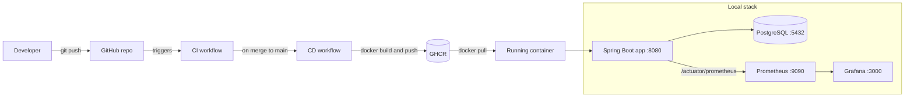

## API

| Method | URL | What it does |
|---|---|---|
| POST | `/api/endpoints` | Add an endpoint to monitor |
| GET | `/api/endpoints` | List all endpoints |
| GET | `/api/endpoints/{id}` | Get one endpoint |
| PUT | `/api/endpoints/{id}` | Update an endpoint |
| DELETE | `/api/endpoints/{id}` | Delete an endpoint |
| GET | `/api/endpoints/{id}/history` | Recent check results (`?limit=20`) |
| GET | `/api/endpoints/{id}/uptime` | Uptime percentage |


# Endpoint Monitor

[](https://github.com/arjunpatilakp04-cell/CodeAlpha_JavaGradleApp/actions/workflows/ci.yml)
[](https://github.com/arjunpatilakp04-cell/CodeAlpha_JavaGradleApp/actions/workflows/cd.yml)


A Spring Boot REST service built with Gradle for the CodeAlpha DevOps Internship, Task 3: Java Application using Gradle. It runs in Docker, is built and delivered by GitHub Actions, and is monitored with Prometheus and Grafana.

## What it does

- Builds the Java project with Gradle
- Runs automated tests on every push (JUnit 5 and Testcontainers, against a real Postgres database)
- Packages the app as a Docker image
- Runs the tests in a CI workflow on every push
- Builds and pushes the image to GitHub Container Registry in a CD workflow on every merge to `main`
- Shows live metrics in Grafana through Spring Boot Actuator and Prometheus

## How it fits together



## Tech stack

| Part | Technology |
|---|---|
| Language | Java 21 |
| Framework | Spring Boot (Web, Data JPA, Validation, Actuator) |
| Database | PostgreSQL |
| Build tool | Gradle |
| Containers | Docker and Docker Compose |
| CI/CD | GitHub Actions |
| Image registry | GitHub Container Registry (GHCR) |
| Metrics | Micrometer and Prometheus |
| Dashboards | Grafana |
| Testing | JUnit 5 and Testcontainers |

## CI/CD pipeline

The CI workflow (`.github/workflows/ci.yml`) runs on every push and pull request. It compiles the project and runs all the tests.

The CD workflow (`.github/workflows/cd.yml`) runs on every push to `main`. It builds the project again, logs in to GHCR, and pushes a Docker image tagged `latest` and with the short commit SHA.

To pull the latest image:

```bash
docker pull ghcr.io/arjunpatilakp04-cell/codealpha_javagradleapp:latest
```

## Run it locally

This starts the app, Postgres, Prometheus and Grafana together:

```bash
docker compose up -d --build
```

| Service | URL |
|---|---|
| App | http://localhost:8080 |
| Health check | http://localhost:8080/actuator/health |
| Raw metrics | http://localhost:8080/actuator/prometheus |
| Prometheus | http://localhost:9090 |
| Grafana | http://localhost:3000 (login: admin / admin) |

## Monitoring

The app exposes metrics at `/actuator/prometheus`: JVM memory, CPU usage, load average, database connection pool stats and HTTP request metrics.

Prometheus reads them every 15 seconds (`monitoring/prometheus.yml`) and is connected to Grafana as a data source automatically (`monitoring/grafana/provisioning/datasources/datasource.yml`).

To see the dashboard:

1. Open Grafana at http://localhost:3000 and log in with `admin` / `admin`.
2. Go to Dashboards, then New, then Import.
3. Enter dashboard ID `12900` (SpringBoot APM Dashboard) and click Load.
4. Choose Prometheus as the data source and click Import.

## Project structure

```text
.
├── src/
├── monitoring/
│   ├── prometheus.yml
│   └── grafana/provisioning/datasources/datasource.yml
├── docker-compose.yml
├── Dockerfile
├── build.gradle.kts
└── .github/workflows/
    ├── ci.yml
    └── cd.yml
```

## License

MIT
